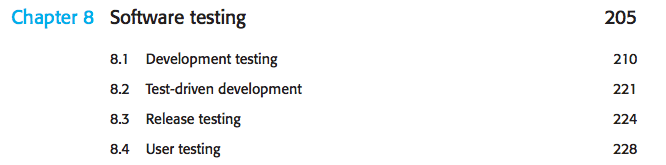
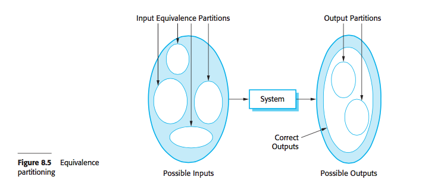
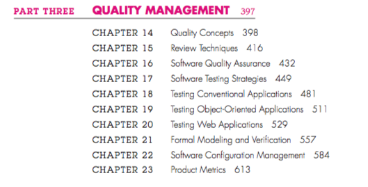
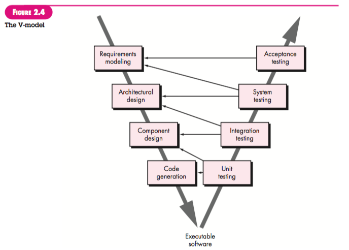
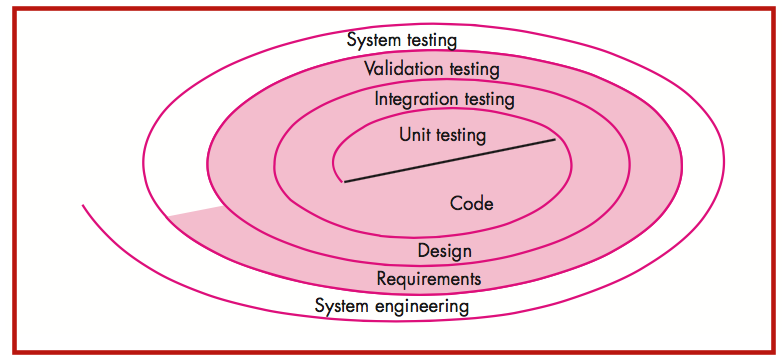

# Testes para gerentes

* Raphael Lacerda
---

# Academia
---
## SommerVille

---

---

* Unit, Component, System, Release
---
## Pressman

---

---

---

---

* Unit, Top-Down Integration, Bottom-Up Integration
* Regression, Smoke, Alpha e Beta
* Recovery, Security, Stress, Performance, Deployment
---

## Fowler

### [Is TDD Dead? ](https://martinfowler.com/articles/is-tdd-dead/)
---

# Indústria
---

